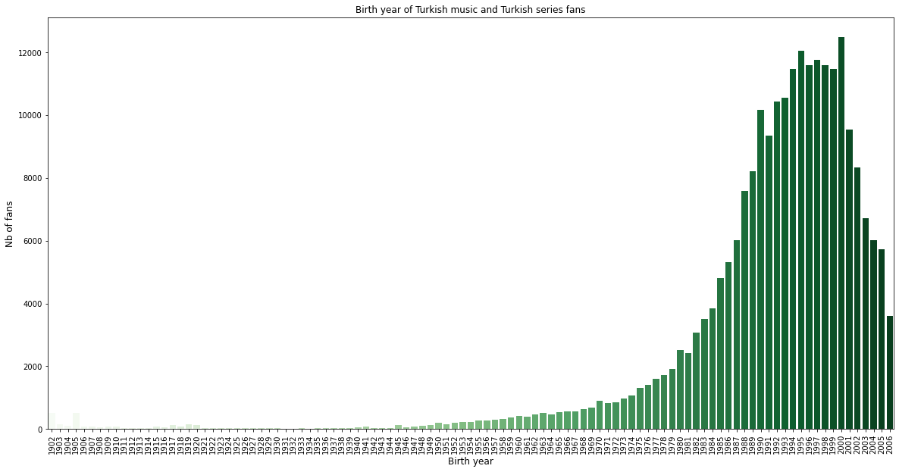
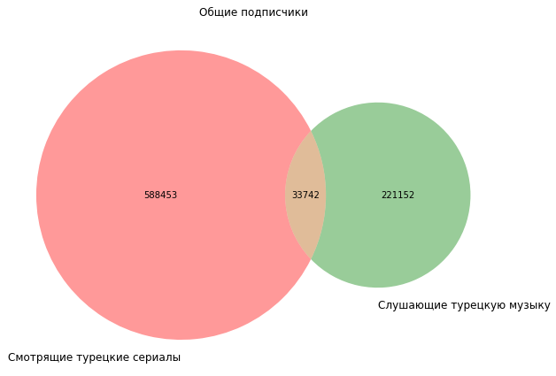

# Влияние просмотра турецких сериалов на прослушивание турецкой музыки

## Задачи исследования:

1. Выбрать наиболее многочисленные по количеству участников группы, посвященных просмотру турециех сериалов и прослушиванию турецкой музыки.

2. Сравнить исследуемые группы и выявить уровень заинтересованности подписчиков групп любителей турецких сериалов в прослушивании турецкой музыки.

3. Визуализировать полученную информацию и сделать выводы исследования.

Нами были выбраны следующие группы для анализа:

[https://vk.com/trmuzik] - наиболее многочисленная группа любителей турецкой музыки, которая насчитывает 221152 подписчиков. 

[https://vk.com/hercaiturksinema] - группа любителей сериала "Ветренный". Данная группа является одной из самых многочисленных. В ней состоят 306797 участников.

[https://vk.com/turksdizi_perevod] - вторая по количеству подписчиков группа, в которой осуществляется перевод турецких сериалов для русскоязычной аудитории. 

[https://vk.com/diziturk] - Группа создана для любителей турецких сериалов и фильмов. В ней можно найти все последние сериалы и фильмы турецкого производства. 

Основную аудиторию группы, посвященных турецким сериалам составляют подписчики, рожденные в период с 1980-х по 2000-е гг. 

После определения групп для анализа мы приступили к сравнению количества участников групп, посященных просмотру турецких сериалов, и подписчиков группы, посвященной турецкой музыке. 

В ходе анализа было выявлено, что всего 16% от общей аудитории двух анализируемых сегментов были включены в просмотр сериалов и прослушивание музыки. 

Это видно на следующей диаграмме:

Из представленных данных можно сделать вывод, что просмотр турецких сериалов сказывается на вовлеченности турецкой культурой, в частности в малой степени влияет на прослушивание турецкой музыки. 
Однако нелостатком данного исследования является то, что некоторые группы любителей турецких сериалов с наиболее активной и вовлеченной аудиторией были недоступны для анализа.
